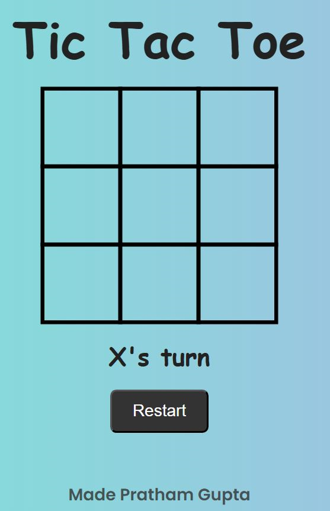
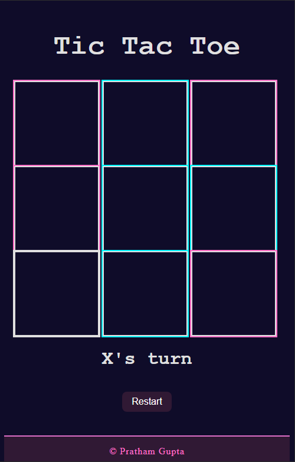

<<<<<<< HEAD
# tic-tac-toe
=======
# 🎮 Tic Tac Toe Game

A simple, responsive Tic Tac Toe game built using **HTML, CSS, and JavaScript**. Play against your friends and enjoy a clean, interactive UI.

---

## 🔗 Live Demo

👉 [Click here to play!](https://prathamcodes04.github.io/tic-tac-toe/)

---

## 📸 Screenshots




---

## 🧩 Features

- ✅ 2-player support
- 🎨 Light and Dark Mode toggle
- 📱 Responsive design for all screens
- 🧠 Win-check logic with highlight
- 🔁 Restart game button

---

## 💻 Tech Stack

- HTML5
- CSS3
- JavaScript (Vanilla)

---

## 🛠️ How to Run Locally

```bash
git clone https://github.com/yourusername/tic-tac-toe.git
cd tic-tac-toe
open index.html

---

📁 Project Structure
markdown
Copy
Edit
tic-tac-toe/
│
├── index.html
├── style.css
├── script.js
├── README.md
└── images/
    └── screenshot1.png

---

🧑‍💻 Made By
Pratham Gupta
🚀 GitHub
📸 LinkedIn


>>>>>>> 8d0cd08 (initial commit)
